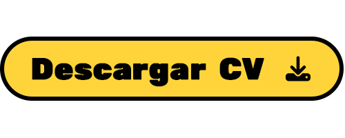
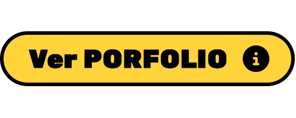

  

  
  

- 👋 ¡Hola! Soy 𝗠𝗮𝗿𝗰 𝗠𝗼𝗿𝗲𝗻𝗼 o @morenomp, como gustes.
- 👍 Estoy interesado en el Desarrollo y Diseño web, además de la producción y edición de vídeos e imágenes.
- 🌱 Actualmente busco trabajo de lo que me apasiona. También comenzaré mi segundo grado superior.
- - - - - - - - - 
- 📫 Puedes contactarme a través de mi correo: rais2004pod@gmail.com
- 👀 Para saber más de mis trabajos, te dejo mi portfolio: https://mmorenop.netlify.app/

<!---
morenomp/morenomp is a ✨ special ✨ repository because its `README.md` (this file) appears on your GitHub profile.
You can click the Preview link to take a look at your changes.
--->
