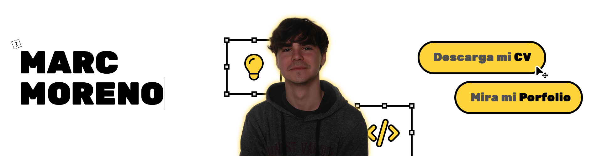
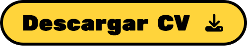
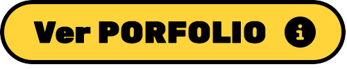

  

 

   
  
   

 

- 👋 ¡Hola! Soy **Marc**, encantado.
- 👍 Estoy interesado en el **_`Diseño gráfico`_** y el **_`Desarrollo web`_**, además de la producción y edición de vídeos e imágenes.
- 🌱 Actualmente busco trabajo de lo que me apasiona a la vez que estudio.
- - - - - - - - - 
- 📫 Puedes contactarme a través de mi correo: [`rais2004pod@gmail.com`](rais2004pod@gmail.com)
- 👀 Para saber más de mis trabajos, te dejo mi portfolio: [`mmorenop.netlify.app`](https://mmorenop.netlify.app/)
- 🔗 Otras redes: [`Linkedin`](https://www.linkedin.com/in/marc-moreno-pineda/) [`YouTube`](https://www.youtube.com/@mmoreno-2004)

> [!NOTE]
> ¿Sabias que también comenzaré mi segundo grado superior?
> Está vez en **desarrollo de aplicaciones web**

## 🛠️ Tecnologías que utilizo:

  

