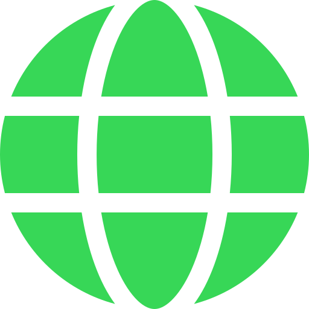

  

 

   
  
   

 

- 👋 ¡Hola! Soy Marc, encantado.
- 👍 Estoy interesado en el **_`Diseño gráfico`_** y el **_`Desarrollo web`_**, además de la producción y edición de vídeos e imágenes.
- 🌱 Actualmente busco trabajo de lo que me apasiona. También estoy haciendo mi segundo grado superior, está vez en **desarrollo de aplicaciones web**.
- 📫 Puedes contactarme a través de mi correo: [**`rais2004pod@gmail.com`**](rais2004pod@gmail.com)
- - - - - - - - - 

/** > [!NOTE]
> ¿Sabias que también comenzaré mi segundo grado superior?
> Está vez en **desarrollo de aplicaciones web** **/

## 🔗 Otras redes:

  
  [ `Portfolio | mmorenop.netlify.app`](https://mmorenop.netlify.app/)
    
  [ `Linkedin | Marc Moreno Pienda`](https://www.linkedin.com/in/marc-moreno-pineda/)
  
  [ `YouTube | @mmoreno-2004`](https://www.youtube.com/@mmoreno-2004)
  

## 🛠️ Tecnologías que utilizo:

  
      -blue?style=for-the-badge) 

## 🛠️ Entornos de desarrollo:

     

## 🛠️ Herramientas:

   

## 🛠️ Herramientas Diseño:

         

